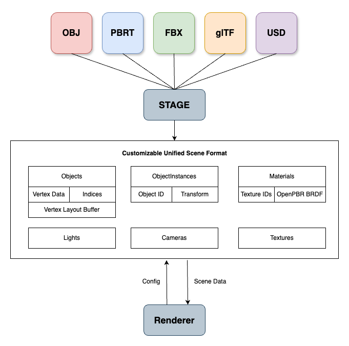

# 🎭 Stage: A Universal 3D Scene Loader
[](https://github.com/DBauer15/stage/actions/workflows/linux.yml)
[](https://github.com/DBauer15/stage/actions/workflows/macos.yml)

Stage is a tool that lets you load various 3D scene and object formats into a uniform representation that is easy to use and integrate into your renderer, ray tracing application or game engine.

## What's on the Stage?
After loading a scene or 3D object with Stage, you can access things like vertex data, materials, or lights from a single `Scene` object. 

Both C and C++ APIs are included.



## Example Usage
The following examples shows how to load a scene file and print the number of objects and instances in it.

### C++ API
```cpp
#include <iostream>
#include <stage.h>

int main(int argc, char** argv) {
    if (argc < 2) {
        std::cout << "Please provide a scene file" << std::endl;
        return -1;
    }

    stage::Config config;
    stage::Scene scene(argv[1], config);
    if (!scene.isValid()) {
        std::cout << "Invalid scene" << std::endl;
        return -1;
    }
    std::cout << "--- SCENE INFO ----" << std::endl;
    std::cout << "Objects:\t" << scene.getObjects().size() << std::endl;
    std::cout << "Instances:\t" << scene.getInstances().size() << std::endl;

    return 0;
}
```

### C API
```c
#include <stdio.h>
#include <stage_c.h>

int main(int argc, char** argv) {
    if (argc < 2) {
        printf("Please provide a scene file\n");
        return -1;
    }

    stage_error_t error;
    stage_config_t config = stage_config_get_default();
    stage_scene_t scene = stage_load(argv[1], config, &error);

    if (error != STAGE_NO_ERROR) {
        printf("Invalid scene\n");
        return -1;
    }

    size_t n_objects, n_instances;
    stage_scene_get_objects(scene, &n_objects);
    stage_scene_get_instances(scene, &n_instances);


    printf("--- SCENE INFO ---\n");
    printf("Objects:\t%i\n", n_objects);
    printf("Instances:\t%i\n", n_instances);

    stage_free(config);
    stage_free(scene);

    return 0;
}
```

## What's inside the Stage?

### The `Scene`
A scene is what you'll get when you first load a file. It contains all the data needed for your application:

* An optional `Camera` if the scene defines one
* List of `Object`, 3D objects defined by the scene
* List of `ObjectInstance`, all the instances of `Object`s
* List of `Lights`, lighting data
* List of `Material`, implementation of the [OpenPBR](https://github.com/AcademySoftwareFoundation/OpenPBR) material type
* List of `Image`, a collection of image data like texture and environment maps
* The `SceneScale` defines the maximum extent of the loaded scene

When creating scenes, you can pass a `Config` to determine the behavior of the parser and the data parsed

* `layout` determines the vertex layout of the parsed data

---
### The `Object` and `Geometry`
An `Object` represents a single 3D entity in a scene. It can be made up of several `Geometry` instances which, combined, represent the whole object.

A `Geometry` is the smallest building block in the scene and contains:
* A list of `indices` 
* A buffer of `positions`
* A buffer of `normals`
* A buffer of `uvs`
* A buffer of `material_ids`

The indices index into each of the buffer objects.
The memory layout of the underlying buffer that stores vertex data is determined by the `layout` config parameter when loading the scene.

All data within an `Object` is guaranteed to be contiguous and adhere to the chosen memory layout. Blocked layouts are blocked separately for each `Geometry`.

The material ID can be used to locate the `Material` that is associated with this vertex.

---
### The `ObjectInstance`
This type represents instances of an `Object` that is placed in the scene and contains:
* An `object_id`
* A `instance_to_world` transformation matrix

---
### The `Light`
Stage uses a single type to represent all lights in the scene. The `Light` contains:
* `L` light intensity color
* `from` point of origin
* `to` point of direction
* A `radius`
* An optional `map_texid`
* A `type`

The type defines what type of light it is and the other fields are interpreted accordingly. For example if `type` is `STAGE_DISTANT_LIGHT`, the difference between its `from` and `to` defines the light direction.

Some lights use textures, like environment maps. The texture is referenced by `map_texid` which indexes into the list of `Image` in the `Scene`.

---
### The `Material`
Material information is parsed from different file and material types into a common material definition. The `Material` type is modeled closely after the [OpenPBR](https://github.com/AcademySoftwareFoundation/OpenPBR) standard.

---
### The `Image`
Images can be anything from environment maps, to visibility masks. The `Image` type exposes the raw image data as a `uint8_t*` pointer and provides access to:
* `width`
* `height`
* Number of `channels`. 

Additionally, the `is_hdr` flag indicates if the image is loaded as HDR or LDR.

## Supported Formats
Stage supports a range of 3D formats and scene descriptors.

- [X] Wavefront OBJ
- [X] PBRTv3 Format
- [ ] PBRTv4 Format
- [X] Autodesk FBX
- [ ] Stanford PLY
- [ ] GL Transmission Format glTF
- [ ] Pixar Universal Scene Descriptor USD

## Projects that use Stage
* FaRT (https://github.com/DBauer15/FaRT) -- My hobby path tracer

## Build Instructions
The project can be built as a standalone library or integrated in an existing project using CMake. 

### Installing Dependencies
Stage depends on `TBB`. Please make sure to have an installation on your system. 

```bash
# On MacOS
brew install tbb

# On Debian/Ubuntu
sudo apt install libtbb-dev
```

Alternatively, get oneTBB here: https://www.intel.com/content/www/us/en/developer/tools/oneapi/onetbb.html

### Building
To build Stage with CMake, run the following commands:

```bash
cmake -B build .
cmake --build build -j
```

### Build Options
The CMake build offers several options to customize the build:

**Logging**
* `STAGE_LOGGING_WARN` - Turn on warning log messages.
* `STAGE_LOGGING_LOG` - Turn on all log messages.
* `STAGE_LOGGING_OFF` - Turn off all logging. This includes success and error messages.

**Examples**
* `STAGE_BUILD_EXAMPLES` - Build exmaple apps in `./examples`.

## License
The code in this repository is licensed under the MIT license.
References to code imported from other projects that are present in code in `./src` are made were such code has been reused.
Please refer to the projects in `./dependencies` to find their respective licenses.
